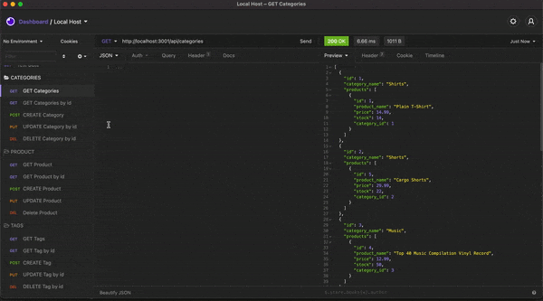

# ORM-E-Commerce-BackEnd

## Description

This application is the backend portion of an E-Commerce website that can be used by online retailers to keep track of their products. The SQL database includes tables for products, categories, tags, and product tags. With the application, a user can add, delete, and update their product list and inventory.

## Technology Used

• Node
• Express
• MySQL2
• Sequelize
• Dotenv

## Installation

• For Installation you need to :
        • Make sure you have Node.js and MySql installed on your computer
        • Install these dependencies.
        • Intialize node package manager and then run the following commands: 
            `npm install mysql2`   
            `npm install sequelize`   
            `npm install dotenv` 

## Walk-Thru Video 

## Links

[GitHub Repository](https://github.com/princessmoss/ORM-E-Commerce-BackEnd)